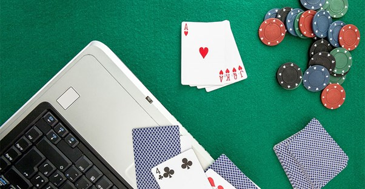

# Reinforcement Learning Project on OhHell

A project to create a reinforcement learning agent to play the card game Oh Hell. The ultimate aim of the project is to search for the best possible strategy when playing this game.

The version of the game used in this code is a simple one-off 10 card game.

This is a link to a website where you can play a Oh Hell game that plays 10 cards then 9 cards all the way down to 1 card and then back up to 10 cards - [Oh Hell Website](https://cardgames.io/ohhell/)

# Credits
This code was build based off of [OhHellProject](https://github.com/anyarko/OhHellProject)

# How to Run
After downloading dependencies, run running_model.py to train a simplified PPO model to play a 2-card game with random bids.

